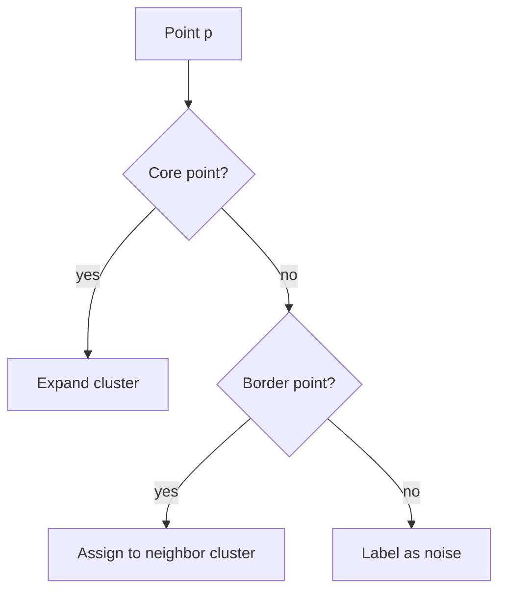

# Phase 4: LLM Skill + Validation - Research

**Researched:** 2026-03-22
**Domain:** Claude Code skill authoring, LLM prompt engineering for structured YAML output, PDF extraction, end-to-end validation
**Confidence:** HIGH (project codebase fully read, established patterns confirmed)

---

<user_constraints>
## User Constraints (from CONTEXT.md)

### Locked Decisions

**Skill Invocation & Input**
- Input types: PDF file OR folder with markdown+image files (same as `/ada-slides-general`)
- Invocation: `/md_to_yaml <flavor> --source path/to/file.pdf` or `/md_to_yaml <flavor> --source path/to/folder/`
- For folder sources: Claude reads images with Read tool to generate accurate captions and alt-text
- Output: YAML + auto-compile to HTML in one step (YAML and HTML written next to source)
- Default diagram mode: client-side Mermaid (built in Phase 3). Note: `/ada-slides-general` SVG mode successfully embeds SVG in HTML — reference that approach if SVG issues arise

**Content Flavors**
- All three flavors supported: explanatory, implementation, tutorial
- Skill reads existing `/ada-slides-general` flavor files at runtime (flavor-explanatory.md, flavor-implementation.md, flavor-tutorial.md) for content guidance
- Flavor shapes layout mix, depth, and style but output is YAML DSL (not raw HTML)

**Layout Selection Strategy**
- Include full `layout_rules.md` in skill prompt — decision tree, content-mapping table, variety rules, structure rules
- IMPORTANT: Deduplicate layout_rules.md before including — remove rendering details (font sizes, bullet limits, padding) already enforced by compiler templates. Keep only: when-to-use guidance, decision tree, variety principle, content-mapping table, structure rules
- Skill does NOT modify templates — it only generates YAML content
- Layout variety enforced at YAML generation time (no 3+ consecutive same layouts)

**Validation & Error Loop**
- Auto-fix and retry: skill validates generated YAML, feeds errors back to LLM, retries up to 3 times
- Validation uses Python Pydantic parser (`parse_deck_file()`) — better errors than JSON Schema
- Skill checks layout variety rules before compiling and auto-adjusts if violated
- After validation passes, compiler runs automatically

**E2E Validation**
- Validate on 3 source PDFs covering different topics:
  1. `../n8n_to_python/slides_density-based.pdf` (clustering — explanatory)
  2. `../n8n_to_python/slides_prototype-based.pdf` (clustering — implementation/tutorial)
  3. `../n8n_to_python/A Survey of Quantum Transformers- Architectures, Challenges and Outlooks_nov2025_zhang etal_review.pdf` (quantum — explanatory)
- Existing HTML decks in `../n8n_to_python/output_html_files/` serve as quality reference (not inputs)
- Pass criteria (ALL must be met):
  1. Generated YAML passes Pydantic parser with no errors
  2. Compiler produces HTML successfully (warnings OK)
  3. Output HTML has ADA compliance (ARIA labels, skip links, alt text, keyboard nav)
  4. Human spot-check: layout variety, readability, professional appearance comparable to existing decks

### Claude's Discretion
- Exact prompt engineering for YAML generation (few-shot examples, system prompt structure)
- How to chunk PDF content into slides (section detection, slide count per topic)
- Error message formatting in retry loop
- Output file naming convention

### Deferred Ideas (OUT OF SCOPE)
- Hook-based auto-compilation (file watcher triggers compiler) — ENH-04 in v2
- Fine-tuned local model on YAML DSL — ENH-03 in v2
- Speaker notes field — ENH-01 in v2
</user_constraints>

---

<phase_requirements>
## Phase Requirements

| ID | Description | Research Support |
|----|-------------|-----------------|
| LLM-01 | `/md_to_yaml` Claude Code skill generates YAML DSL from markdown/JPEG/PDF input | Skill file structure mirrors `/ada-slides-general` SKILL.md pattern; compiler CLI and parser fully implemented |
| LLM-02 | Skill enforces design constraints (layout variety, bullet limits, alt text) | `validators.py` already checks all three; skill prompt includes `layout_rules.md` sections; retry loop feeds Pydantic errors back to LLM |
| LLM-03 | YAML schema validation available (JSON Schema) to catch errors before compilation | `parse_deck_file()` with Pydantic gives richer errors than JSON Schema; JSON Schema at `schema/deck.schema.json` also available as reference |
</phase_requirements>

---

## Summary

Phase 4 creates the `/md_to_yaml` Claude Code skill — the final user-facing component that ties together all prior phases. The skill is a Markdown file at `~/.claude/skills/md_to_yaml/SKILL.md` that instructs Claude how to read a source (PDF or folder), generate YAML using the 12-layout DSL, validate it via the existing Pydantic parser, and compile it to HTML in one integrated pipeline.

The core technical work is prompt engineering: the skill prompt must include a deduplicated version of `layout_rules.md` (decision tree, variety rules, content-mapping table, structure rules — but NOT rendering details the compiler already handles), plus a few-shot YAML example covering multiple layout types. The auto-fix retry loop (up to 3 attempts) runs `parse_deck_file()` programmatically; errors are formatted as actionable correction instructions fed back to the LLM generation step.

E2E validation runs the complete skill on 3 real PDFs, confirming the pipeline produces ADA-compliant HTML with layout variety. All required infrastructure (parser, compiler, validators) is fully implemented — Phase 4 is purely skill authoring, prompt engineering, and validation.

**Primary recommendation:** Model the skill file structure directly on `/ada-slides-general/SKILL.md` (same source-type detection, flavor loading, required-steps ordering) but redirect output to YAML+compile instead of raw HTML generation.

---

## Standard Stack

### Core
| Library | Version | Purpose | Why Standard |
|---------|---------|---------|--------------|
| Python (Pydantic v2) | already installed | YAML validation via `parse_deck_file()` | Already used in Phases 1-3; richer errors than JSON Schema |
| PyYAML | already installed | YAML parsing in parser.py | Already used throughout project |
| `python -m compiler` | project | Compile validated YAML to HTML | Phase 2-3 deliverable, CLI fully functional |

### Supporting
| Library | Version | Purpose | When to Use |
|---------|---------|---------|-------------|
| `schema/deck.schema.json` | project | JSON Schema reference (837 lines) | Available as secondary validation reference; prefer Pydantic parser for clearer errors |
| Bash tool (in skill) | Claude Code built-in | Run `python3 -m compiler` and `python3 -c "from schema.parser import parse_deck_file; ..."` | Skill uses Bash to invoke compile and validate steps |

### Installation
No new packages needed — all dependencies are installed from Phases 1-3.

---

## Architecture Patterns

### Skill File Structure
```
~/.claude/skills/md_to_yaml/
├── SKILL.md                    # Main skill instructions (the only required file)
```

The skill reads flavor files and layout rules at runtime from the existing locations:
- `/Users/erlebach/.claude/skills/ada-slides-general/flavor-{flavor}.md`
- `layout_rules.md` (project-local, path relative to source)
- `/Users/erlebach/.claude/skills/ada-slides-general/accessibility-core.md`

### Pattern 1: Skill File Format (mirrors ada-slides-general)

**What:** SKILL.md with YAML frontmatter + step-by-step instructions
**When to use:** All Claude Code skills follow this pattern

```yaml
---
name: md_to_yaml
description: Generate YAML DSL slide decks from PDF or folder input, then compile to ADA-compliant HTML. Use when the user wants to convert source material into a structured YAML slide deck using the 12-layout DSL system.
---
```

Required steps section mirrors `/ada-slides-general` ordering:
1. Detect source type (PDF or folder)
2. Identify flavor (explanatory / implementation / tutorial)
3. Read accessibility-core.md
4. Read the flavor file
5. Read (deduplicated) layout_rules.md sections
6. Plan slide structure and chunk content
7. Generate YAML DSL
8. Validate via `parse_deck_file()` — retry up to 3x on errors
9. Check layout variety (no 3+ consecutive same layouts) — adjust if violated
10. Compile via `python3 -m compiler input.yaml output.html`

### Pattern 2: YAML DSL Format

The hybrid YAML+Markdown format uses `---` fences. Key rules confirmed from `parser.py`:
- `body:` must NOT appear in YAML frontmatter — body content goes BELOW the closing `---`
- Slides are separated by `---` lines at start of line
- First block is deck metadata; subsequent blocks are slides

```yaml
---
title: Clustering Algorithms
author: Researcher
date: 2026-03-22
theme: dark
font: IBM Plex Sans
---

---
layout: title
title: Density-Based Clustering
subtitle: DBSCAN and OPTICS
---

---
layout: content
title: Core Concepts
---
- **Epsilon neighborhood**: radius defining point proximity
- **Core points**: points with ≥ MinPts neighbors in ε-radius
- **Border points**: within ε of core point, fewer than MinPts neighbors
- **Noise points**: neither core nor border

---
layout: diagram
title: DBSCAN Cluster Formation
alt_text: "Flowchart showing how DBSCAN assigns core, border, and noise labels based on epsilon and MinPts parameters"
---

```

### Pattern 3: Validation + Retry Loop

**What:** Run `parse_deck_file()` after each YAML generation attempt; feed errors back
**When to use:** Always — before invoking compiler

```python
# Skill runs this via Bash tool:
python3 -c "
from schema.parser import parse_deck_file
import sys, json
try:
    deck = parse_deck_file('output.yaml')
    print('VALID')
except Exception as e:
    print(f'ERROR: {e}')
    sys.exit(1)
"
```

Error messages from Pydantic are actionable — they name the exact field and layout type. The retry prompt must include:
1. The original generation instruction
2. The full error text
3. The specific slide number and field to fix
4. The corrected constraint (e.g., "body: must not appear in frontmatter")

### Pattern 4: Layout Variety Check (pre-compile)

Before calling compiler, skill checks consecutive layout runs. This is already implemented in `compiler/validators.py:_check_layout_variety()` — the skill can invoke it directly OR check the compiler's warning output and re-generate if needed.

The compiler returns warnings (not errors) for layout variety violations. Strategy: treat any layout variety WARNING from compiler as a signal to regenerate that section with variety corrections.

### Recommended Project Structure for Skill Output
```
<source_dir>/
├── <basename>.yaml          # Generated YAML DSL
└── <basename>-<flavor>-<timestamp>.html   # Compiled HTML
```

Output written next to source file (same directory), matching `/ada-slides-general` naming pattern.

### Anti-Patterns to Avoid
- **Generating HTML directly:** The skill outputs YAML only — HTML comes from the compiler. Never bypass the compiler.
- **Including rendering details in skill prompt:** Font sizes, pixel padding, clamp() values are compiler concerns. The skill prompt's layout_rules excerpt must strip Section VII (Accessibility & Readability) font size specifics.
- **body: in YAML frontmatter:** Parser raises a clear ValueError for this. It is the most common LLM error; the few-shot examples must demonstrate correct body placement.
- **Skipping alt_text on diagram/figure slides:** Compiler errors (not warns) on missing alt_text. Every diagram and figure slide must have a non-empty `alt_text` field.
- **Using layout types not in the 12:** The discriminated union in `models.py` rejects unknown layout values. The skill prompt must list exactly: title, hero, content, divider, figure, diagram, two-column, quote, comparison, code, steps, summary, table.

---

## Don't Hand-Roll

| Problem | Don't Build | Use Instead | Why |
|---------|-------------|-------------|-----|
| YAML validation | Custom regex/YAML checker | `parse_deck_file()` + Pydantic | Already handles body-in-frontmatter, discriminated union, field type checks, extra='forbid' |
| Layout variety check | Count consecutive layouts in skill | `compiler/validators.py:validate_deck()` | Already implemented, returns structured warnings |
| Alt-text enforcement | Manual check in skill | Compiler's `_check_alt_text()` | Raises errors with slide number and field name |
| HTML compilation | Skill generates HTML | `python3 -m compiler input.yaml output.html` | Deterministic, ADA-compliant, theme-aware |
| Contrast validation | Color math in skill | Compiler's `_check_contrast()` | Uses correct WCAG formula |

**Key insight:** Every validator needed for LLM-02 and LLM-03 is already implemented. Phase 4 wires them together in a skill flow — it does not build new validation infrastructure.

---

## Common Pitfalls

### Pitfall 1: body: field in YAML frontmatter
**What goes wrong:** LLM writes `body: "- bullet 1\n- bullet 2"` inside the YAML block
**Why it happens:** LLM treats YAML frontmatter as the only place to put content
**How to avoid:** Few-shot examples must show body content below closing `---` fence; prompt must explicitly state "body content goes BELOW the closing --- separator, never inside YAML"
**Warning signs:** `ValueError: Field 'body' found in YAML frontmatter` from parser

### Pitfall 2: Unknown layout type
**What goes wrong:** LLM invents layouts like `bullet-list`, `overview`, `intro`
**Why it happens:** LLM generalizes from common slide terminology
**How to avoid:** Skill prompt must list the exact 12 layout values as a closed enum; few-shot examples cover all 12
**Warning signs:** `pydantic.ValidationError: ... discriminator 'layout'`

### Pitfall 3: Missing alt_text on diagram slides
**What goes wrong:** Compiler exits with error on diagram/figure slides missing alt_text
**Why it happens:** LLM omits optional-looking fields
**How to avoid:** Prompt must state alt_text is REQUIRED for diagram and figure layouts; include in few-shot template for those layouts
**Warning signs:** `**ERROR** slide N: missing alt_text on diagram slide`

### Pitfall 4: TableSlide data in wrong fields
**What goes wrong:** LLM writes table data in body instead of `headers:` and `rows:` fields
**Why it happens:** Table layout has structured fields unlike other layouts
**How to avoid:** Include a table layout example in few-shot showing headers/rows structure; note that table layout uses NO body content
**Warning signs:** Pydantic ValidationError or empty table in compiled HTML

### Pitfall 5: PDF content chunking produces too many content slides consecutively
**What goes wrong:** 5+ consecutive content slides from dense PDF sections
**Why it happens:** LLM maps one PDF paragraph to one slide without layout variety
**How to avoid:** Include layout variety rule in prompt ("no 3+ consecutive same layout"); include progressive disclosure pattern (hero → content → diagram/two-column → summary)
**Warning signs:** Compiler warnings about consecutive layouts

### Pitfall 6: Mermaid diagram body contains triple-backtick fences
**What goes wrong:** YAML body with ` ```mermaid ` fences breaks parser (looks like frontmatter boundary)
**Why it happens:** LLM copies markdown code block syntax
**How to avoid:** Show in few-shot that diagram body uses plain mermaid code without outer fences; the compiler wraps it automatically
**Warning signs:** Parser splits slide incorrectly or diagram renders as text

---

## Code Examples

### Deck Metadata Block
```yaml
# Source: schema/models.py DeckMetadata
---
title: Density-Based Clustering
author: Research Team
date: 2026-03-22
theme: dark
font: IBM Plex Sans
---
```

### TwoColumnSlide with diagram + content
```yaml
# Source: schema/models.py TwoColumnSlide, ColumnContent
---
layout: two-column
title: DBSCAN Architecture
proportion: 60/40
left:
  type: diagram
  alt_text: "Flowchart showing DBSCAN core/border/noise classification"
  source: |
    graph TD
      A[Input Point] --> B{Core?}
      B -->|yes| C[Expand]
      B -->|no| D[Border/Noise]
---
- Epsilon defines neighborhood radius
- MinPts threshold separates core from border
- Noise points never assigned to clusters
```

### Validation Call (Bash tool in skill)
```bash
# Source: schema/parser.py parse_deck_file()
cd /path/to/project && python3 -c "
from schema.parser import parse_deck_file
try:
    deck = parse_deck_file('output.yaml')
    print('VALID:', len(deck.slides), 'slides')
except Exception as e:
    print('VALIDATION ERROR:', str(e))
    exit(1)
"
```

### Compiler Invocation
```bash
# Source: compiler/__main__.py
python3 -m compiler output.yaml output.html
# With image embedding:
python3 -m compiler output.yaml output.html --embed-images
```

### Validator Call (check warnings before compiling)
```python
# Source: compiler/validators.py validate_deck()
from schema.parser import parse_deck_file
from compiler.validators import validate_deck

deck = parse_deck_file('output.yaml')
errors, warnings = validate_deck(deck)
# errors must be empty; warnings about layout variety → regenerate
```

---

## State of the Art

| Old Approach | Current Approach | When Changed | Impact |
|--------------|------------------|--------------|--------|
| LLM generates HTML directly (`/ada-slides-general`) | LLM generates YAML DSL; compiler produces HTML | Phase 1-3 | Deterministic HTML, schema-validated structure, ADA guaranteed by compiler |
| Manual slide creation | `/md_to_yaml` skill with auto-compile | Phase 4 | Full pipeline from PDF/folder to HTML in one skill invocation |

**Note:** The `/ada-slides-general` skill (raw HTML generation) remains available for cases where direct HTML is preferred. The new `/md_to_yaml` skill adds the YAML-DSL pathway, trading some prompt freedom for schema enforcement and ADA guarantees.

---

## Open Questions

1. **Mermaid diagram body delimiters in YAML**
   - What we know: `compiler/engine.py` renders Mermaid from slide body content
   - What's unclear: Does the compiler expect raw Mermaid syntax in body, or does it need a fence? Need to verify `engine.py` DiagramSlide rendering
   - Recommendation: Read `compiler/engine.py` during plan/implementation to confirm exact format; include correct example in skill prompt

2. **PDF extraction fidelity**
   - What we know: Claude's Read tool can extract text from PDFs; `/ada-slides-general` uses it successfully
   - What's unclear: How well mathematical notation (KaTeX) is preserved from quantum/ML PDFs
   - Recommendation: Accept that complex formulas may need manual correction; skill should note this limitation

3. **Output filename convention**
   - What we know: User left this to Claude's discretion
   - What's unclear: Whether to use the source filename or a generated name
   - Recommendation: Use `<source_basename>-<flavor>-<YYYYMMDD_HHMM>.yaml` and same with `.html`; consistent with `/ada-slides-general` timestamp pattern

---

## Validation Architecture

### Test Framework
| Property | Value |
|----------|-------|
| Framework | pytest (already configured) |
| Config file | `pyproject.toml` |
| Quick run command | `cd /Users/erlebach/src/2026/claude-code/n8n/md_to_yaml && python3 -m pytest tests/ -x -q` |
| Full suite command | `cd /Users/erlebach/src/2026/claude-code/n8n/md_to_yaml && python3 -m pytest tests/ -v` |

### Phase Requirements → Test Map
| Req ID | Behavior | Test Type | Automated Command | File Exists? |
|--------|----------|-----------|-------------------|-------------|
| LLM-01 | Skill file exists and follows required structure | manual | inspect `~/.claude/skills/md_to_yaml/SKILL.md` | ❌ Wave 0 |
| LLM-01 | Running skill on a markdown document produces valid YAML | integration | `parse_deck_file()` on skill output | ❌ Wave 0 |
| LLM-02 | Generated YAML has no 3+ consecutive identical layouts | unit | `pytest tests/test_skill_output.py::test_layout_variety -x` | ❌ Wave 0 |
| LLM-02 | Bullet limits and alt_text enforced | unit | existing `validate_deck()` + new fixture | ❌ Wave 0 |
| LLM-03 | YAML passes `parse_deck_file()` with no errors | unit | `pytest tests/test_skill_output.py::test_yaml_validates -x` | ❌ Wave 0 |
| LLM-03 | Field-name variant `body` in frontmatter gives clear error | unit | `pytest tests/test_parser.py::test_body_in_frontmatter -x` | ✅ (existing test) |
| E2E | 3 PDFs produce ADA-compliant HTML | e2e | manual spot-check + axe/WAVE in browser | manual-only |

### Sampling Rate
- **Per task commit:** `python3 -m pytest tests/ -x -q --tb=short`
- **Per wave merge:** `python3 -m pytest tests/ -v`
- **Phase gate:** Full suite green + E2E manual spot-check on all 3 PDFs

### Wave 0 Gaps
- [ ] `tests/test_skill_output.py` — covers LLM-01, LLM-02, LLM-03 with fixture YAML files
- [ ] `tests/fixtures/skill_output_sample.yaml` — sample LLM-generated YAML for unit tests
- [ ] E2E manual checklist document (not automated) — covers PDF→HTML pipeline for 3 decks

---

## Sources

### Primary (HIGH confidence)
- Project codebase: `schema/models.py`, `schema/parser.py`, `compiler/__main__.py`, `compiler/validators.py` — read directly
- Project files: `layout_rules.md`, `tests/conftest.py` — read directly
- `/Users/erlebach/.claude/skills/ada-slides-general/SKILL.md` — read directly; established skill invocation pattern

### Secondary (MEDIUM confidence)
- `.planning/phases/04-llm-skill-validation/04-CONTEXT.md` — user decisions document
- `.planning/REQUIREMENTS.md` — LLM-01, LLM-02, LLM-03 definitions
- `.planning/STATE.md` — accumulated project decisions

### Tertiary (LOW confidence)
- None — all research based on direct codebase reading

---

## Metadata

**Confidence breakdown:**
- Standard stack: HIGH — all libraries already installed and used in prior phases
- Architecture: HIGH — skill structure directly modeled on existing `/ada-slides-general` SKILL.md
- Pitfalls: HIGH — derived from reading actual parser error handling and validator code
- E2E validation targets: HIGH — PDF files confirmed present on filesystem

**Research date:** 2026-03-22
**Valid until:** 2026-06-22 (stable — no external dependencies changing)
