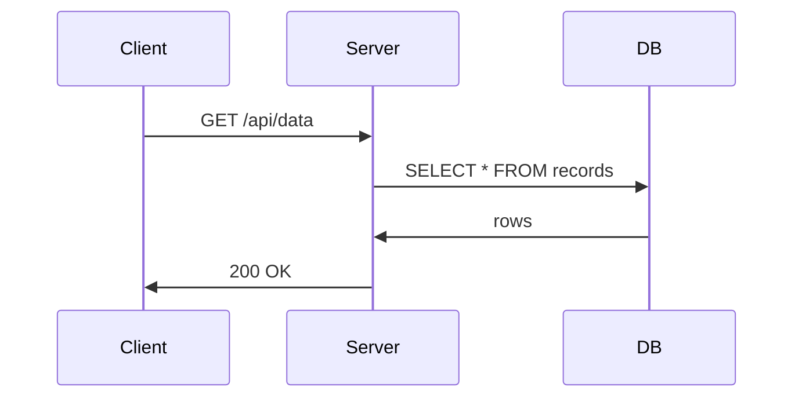

# Layout Primitives Reference

This document describes the 12 layout types available in the slide DSL. Each slide is a hybrid YAML+Markdown block: YAML frontmatter (between `---` markers) carries structured fields, and a Markdown body below the closing `---` carries free content.

---

## Shared Fields

Every slide type supports these fields:

| Field    | Type            | Required | Description                                             |
|----------|-----------------|----------|---------------------------------------------------------|
| `layout` | string (enum)   | yes      | Layout type identifier. Must match one of the 12 types. |
| `title`  | string          | yes      | Slide heading shown to the audience.                    |
| `notes`  | string          | no       | Speaker notes. Rendered as `<aside>` in the HTML output.|
| `body`   | Markdown (body) | —        | Markdown content written below the closing `---`. Not a YAML field. |

---

## title

**Use for:** Deck opener. First slide of the presentation. Shows a large title, optional subtitle, and optional author name.

| Field      | Type   | Required | Description                     |
|------------|--------|----------|---------------------------------|
| `subtitle` | string | no       | Secondary title below main title |
| `author`   | string | no       | Presenter name                   |

**Example:**
```yaml
---
layout: title
title: Introduction to Distributed Systems
subtitle: Patterns, Trade-offs, and Real-World Practice
author: Jane Smith
---
```

---

## hero

**Use for:** Section opener within a deck. Introduces a major topic or chapter break with a section title and optional short description.

| Field         | Type   | Required | Description                            |
|---------------|--------|----------|----------------------------------------|
| `description` | string | no       | One-line summary of the section's scope |

**Example:**
```yaml
---
layout: hero
title: Part 2: Consensus Algorithms
description: How distributed nodes agree on a single value
---
```

---

## content

**Use for:** Generic content slide with a title and free Markdown body. Use for bullet points, prose, or mixed content.

| Field  | Type     | Required | Description                   |
|--------|----------|----------|-------------------------------|
| body   | Markdown | no       | Markdown body below closing `---` |

**Example:**
```yaml
---
layout: content
title: Key Properties of Raft
---
Raft achieves consensus via:

- **Leader election** — one node coordinates all writes
- **Log replication** — leader replicates entries to followers
- **Safety** — committed entries are never overwritten
```

---

## divider

**Use for:** Visual section break. Renders as a full-bleed divider slide with only a title. No body content.

| Field | Type | Required | Description         |
|-------|------|----------|---------------------|
| —     | —    | —        | No additional fields |

**Example:**
```yaml
---
layout: divider
title: Questions & Discussion
---
```

---

## figure

**Use for:** Raster image slide (JPEG/PNG). `alt_text` is required for ADA compliance.

| Field      | Type   | Required | Description                                        |
|------------|--------|----------|----------------------------------------------------|
| `src`      | string | yes      | Relative path or URL to the image file             |
| `alt_text` | string | yes      | Descriptive text for screen readers (ADA required) |

**Example:**
```yaml
---
layout: figure
title: System Architecture
src: images/architecture.png
alt_text: Three microservices connected by a message queue, with a shared PostgreSQL database
---
```

---

## diagram

**Use for:** SVG or Mermaid diagram slide. `alt_text` is required for ADA compliance. The Mermaid source goes in the Markdown body as a fenced code block.

| Field      | Type     | Required | Description                                        |
|------------|----------|----------|----------------------------------------------------|
| `alt_text` | string   | yes      | Descriptive text for screen readers (ADA required) |
| body       | Markdown | no       | Mermaid code block or inline SVG                   |

**Example:**
```yaml
---
layout: diagram
title: Request Flow
alt_text: Sequence diagram showing a client sending a request to the server, which queries the database and returns a result
---

```

---

## two-column

**Use for:** Side-by-side layout. Structured content (image, diagram) goes in `left:` or `right:` frontmatter fields. Free text goes in the body. Use `<!-- split -->` if both columns have free text.

| Field        | Type          | Required | Description                               |
|--------------|---------------|----------|-------------------------------------------|
| `left`       | ColumnContent | no       | Structured left column (figure or diagram) |
| `right`      | ColumnContent | no       | Structured right column (figure or diagram)|
| `proportion` | enum          | no       | Column widths: `50/50` (default), `40/60`, `60/40` |
| body         | Markdown      | no       | Free-text content (fills unstructured column) |

**ColumnContent fields:**

| Field      | Type   | Required          | Description                                  |
|------------|--------|-------------------|----------------------------------------------|
| `type`     | enum   | yes               | `figure` or `diagram`                        |
| `src`      | string | if type=figure    | Image path                                   |
| `alt_text` | string | yes (ADA)         | Descriptive text for screen readers          |
| `source`   | string | if type=diagram   | Mermaid source code (for two-column diagrams)|

**Conventions:**
- If one column is structured (frontmatter) and the other is free text, put the free text in the Markdown body.
- If both columns are free text, use `<!-- split -->` in the body to separate left from right.
- If both columns are structured, put both in frontmatter with no body needed.

**Example — text + image:**
```yaml
---
layout: two-column
title: The Gaussian Kernel
right:
  type: figure
  src: images/kernel.png
  alt_text: Bell-shaped Gaussian kernel density plot centered at zero
---
Each data point contributes a smooth influence function centered at its location.
The bandwidth parameter h controls the width of the kernel.
```

**Example — both text columns:**
```yaml
---
layout: two-column
title: Before vs After Refactoring
---
**Before:** Nested conditionals, 80-line function, no tests

<!-- split -->

**After:** Single responsibility, 12-line function, full coverage
```

---

## quote

**Use for:** Pull-quote slide. Displays a prominent quote from the Markdown body with an optional attribution line.

| Field           | Type   | Required | Description               |
|-----------------|--------|----------|---------------------------|
| `attribution`   | string | no       | Speaker or source name     |
| body            | Markdown | no     | The quote text             |

**Example:**
```yaml
---
layout: quote
title: On Simplicity
attribution: Tony Hoare
---
There are two ways of constructing a software design: one way is to make it so simple that there are obviously no deficiencies, and the other way is to make it so complicated that there are no obvious deficiencies.
```

---

## comparison

**Use for:** Side-by-side comparison of two alternatives. Uses `<!-- split -->` in the Markdown body to divide left from right content.

| Field | Type     | Required | Description                                   |
|-------|----------|----------|-----------------------------------------------|
| body  | Markdown | no       | Two sections separated by `<!-- split -->`    |

**Example:**
```yaml
---
layout: comparison
title: Monolith vs Microservices
---
**Monolith**

- Simple deployment
- Easier local development
- Single failure domain

<!-- split -->

**Microservices**

- Independent scaling
- Technology diversity
- Complex orchestration
```

---

## code

**Use for:** Code block slide. Put the fenced code block in the Markdown body. Set `language` for syntax highlighting.

| Field      | Type   | Required | Description                                      |
|------------|--------|----------|--------------------------------------------------|
| `language` | string | no       | Syntax highlighting language (default: `text`)   |
| body       | Markdown | no     | Fenced code block containing the code            |

**Example:**
```yaml
---
layout: code
title: Fibonacci in Python
language: python
---
```python
def fib(n: int) -> int:
    a, b = 0, 1
    for _ in range(n):
        a, b = b, a + b
    return a

print(fib(10))  # 55
```
```

---

## steps

**Use for:** Numbered steps or sequential process. Put the ordered list in the Markdown body.

| Field | Type     | Required | Description                      |
|-------|----------|----------|----------------------------------|
| body  | Markdown | no       | Ordered list of steps            |

**Example:**
```yaml
---
layout: steps
title: Setting Up the Development Environment
---
1. Install Python 3.12 or later
2. Clone the repository: `git clone https://github.com/org/project`
3. Create a virtual environment: `python -m venv .venv`
4. Install dependencies: `pip install -r requirements.txt`
5. Run tests: `pytest tests/ -x -q`
```

---

## summary

**Use for:** Summary or recap slide at the end of a section or deck. Visually distinct from `content` — typically rendered with checkmark or emphasis bullets.

| Field | Type     | Required | Description              |
|-------|----------|----------|--------------------------|
| body  | Markdown | no       | Recap points as a list   |

**Example:**
```yaml
---
layout: summary
title: What We Covered
notes: Emphasize the third point — it's the key takeaway
---
- Distributed systems require explicit trade-offs between consistency and availability
- Raft provides understandable consensus at the cost of a strong leader
- Practical systems combine multiple algorithms for different subsystems
```

---

## Two-Column Conventions Summary

| Scenario                     | How to write it                                                |
|------------------------------|----------------------------------------------------------------|
| Left: text, Right: image     | `right:` in frontmatter + free text in body                    |
| Left: image, Right: text     | `left:` in frontmatter + free text in body                     |
| Both text                    | `<!-- split -->` in body (no frontmatter columns)              |
| Both structured              | Both `left:` and `right:` in frontmatter, empty body           |
| Narrow/wide split            | `proportion: 40/60` or `proportion: 60/40` in frontmatter     |

The `<!-- split -->` marker must appear on its own line surrounded by blank lines for reliable parsing. If it appears more than once, only the first occurrence is used.
